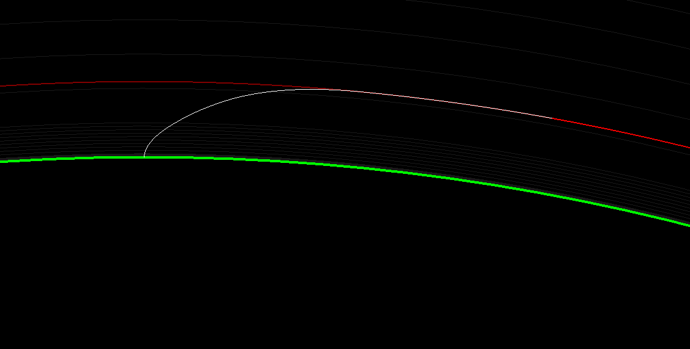

# rocket-optimize

`rocket-optimize` is a C#/.NET project for producing "optimized" orbital launch vehicle ascent trajectories.

## Algorithm

The program uses in part a stochastic optimizing algorithm as well as a terminal guidance algorithm that implements a PI-controller.
It can produce accurate orbit insertions (the example shown below is for a target orbit of 200 km):

